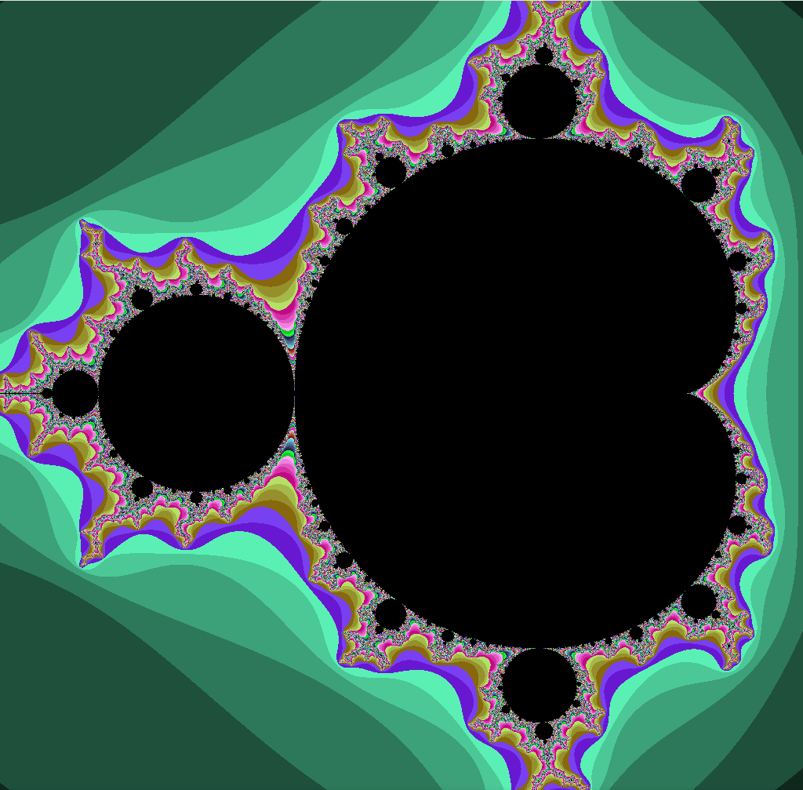
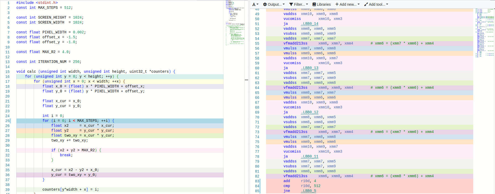
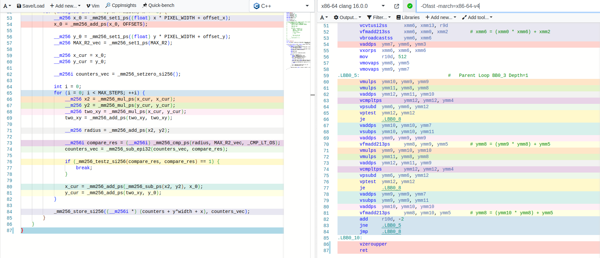

## Использование AVX инструкций для ускорения вычислений в параллелизуемых алгоритмах
### Описание
Для анализа возможностей AVX инструкций было рассмотрено две задачи: расчет множества Мандельброта и наложение с учетом прозрачности.

### Общая методика измерения
Тесты проводились на AMD Ryzen 7 4800H с версиями компиляторами GCC v12.2.1, Clang v15.0.7. Для чистоты измерений во время замеров
на ноутбуке не было запущено никаких других приложений, планировщик CPU был выставлен в perfomance (процессор зафиксирован на максимальной частоте) и
программе был выдан максимальный приоритет.

Чтобы снизить влияние оставшихся факторов проводились множественные измерения, которые после усреднялись и высчитывалось
среднеквадратичное отклонение. Код был собран с флагами `-Ofast -march=znver2 -mtune=znver2 -flto`, чтобы честно сравнивать
эффект ускорения только интринсиками.

### Mandelbrot

Для каждой точки квадрата `-2 < x,y < 2` рассчитывается, на какой итерации расчета множества Мандельброта расстояние
до точки `(0, 0)` становится больше критического (`R = 2`). На основе этих счетчиков позже точки раскрашиваются в цвета и
отрисовываются с помощью SFML.



#### Результаты

| Version | GCC           | Clang         | Среднее ускорение   |
|---------|---------------|---------------|---------------------|
| scalar  | 460 ± 0.13 ms | 459 ± 0.09 ms | baseline | baseline |
| vector  | 58  ± 0.06 ms | 60 ± 0.07 ms  | 7.91 ± 0.010 | 7.65 ± 0.010|

<details>
  <summary>Полные данные измерений: </summary>

    Первый запуск:

```text
    Benchmark results (dumb::calc): 460 ± 0.736348 ms (100 iterations, GCC v12.2.1)
    Benchmark results (avx::calc): 58 ± 0.124553 ms (100 iterations, GCC v12.2.1)
    Benchmark results (dumb::calc): 459 ± 0.165074 ms (100 iterations, Clang v15.0.7)
    Benchmark results (avx::calc): 60 ± 0.103167 ms (100 iterations, Clang v15.0.7)
```

    Второй запуск: 

```text
Benchmark results (dumb::calc): 460 ± 0.1328 ms (100 iterations, GCC v12.2.1)
Benchmark results (avx::calc): 58 ± 0.06315 ms (100 iterations, GCC v12.2.1)
Benchmark results (dumb::calc): 459 ± 0.0943684 ms (100 iterations, Clang v15.0.7)
Benchmark results (avx::calc): 60 ± 0.0674793 ms (100 iterations, Clang v15.0.7)
```

</details>

#### Анализ оптимизаций компилятора
##### baseline реализация
Как можно видеть в выводе [godbolt](https://godbolt.org/z/fdqssooTa), единственное примененная оптимизация компилятора для базовой реализацией алгоритма
это развертка внутреннего цикла на 4 итерации.
Причем количество итераций зависит от архитектуры под которую компилируется код. Так, `-march=x86-64-v4` дает
развертку в 4 итерации, а `znver2` не разворачивает цикл вовсе.


##### SIMD реализация
Ссылка на godbolt: https://godbolt.org/z/fdqssooTa

Здесь компилятор также применил развертку цикла (2 итерации для `x86-64-v4`, без развертки для `znver2`), однако он также
переупорядочил инструкции. Можно заметить, что две команды
```cpp
__m256 two_xy = _mm256_mul_ps(x_cur, y_cur);
two_xy = _mm256_add_ps(two_xy, two_xy);
```
сильно переместились по программе, вплотную к инструкциям
```
x_cur = _mm256_add_ps(_mm256_sub_ps(x2, y2), x_0);
y_cur = _mm256_add_ps(two_xy, y_0);
```
так как это единственное место, где используется это вычисление.

#### Подвывод
Достигнуто практически максимально возможное ускорение в 8 раз, так как за один раз в AVX регистре находятся 8 float-точек.
Заметим, что даже с агрессивными опциями оптимизатора компилятор не смог применить векторные инструкции, что показывает
необходимость знать и применять SIMD инструкции где это уместно.

### Alpha blending

В данной части требовалось наложить одно изображение на другое с учетом прозрачности:


Для более чистого результата сравнения накладывались изображения большого (4242x6000 пикселей) и одинакового размера, чтобы
исключить время копирования пикселей.

#### Результаты (1000 итераций)

| Version | GCC           | Clang         | Среднее ускорение   |
|---------|---------------|---------------|---------------------|
| scalar  | 50 ± 0.78 ms  | 48 ± 0.09 ms  | baseline | baseline |
| vector  | 13  ± 0.54 ms | 14 ± 0.07 ms  | 3.85 ± 0.22 | 3.43 ± 0.02|

<details>
  <summary>Полные данные измерений: </summary>

```text
    Benchmark results (scalar::mix): 50 ± 0.783068 ms (1000 iterations, GCC v12.2.1)
    Benchmark results (vector::mix): 13 ± 0.540932 ms (1000 iterations, GCC v12.2.1)
    Benchmark results (scalar::mix): 48 ± 0.702452 ms (1000 iterations, Clang v15.0.7)
    Benchmark results (vector::mix): 14 ± 0.611695 ms (1000 iterations, Clang v15.0.7)
```

</details>

#### Подвывод
В данной задаче тоже практически достигнуто теоретически максимальное ускорение в 4 раза, так как за раз 2 `AVX` регистра обрабатывают
8 пикселей. К сожалению, из-за хардварных причин суперскалярность процессора не смогла параллельно исполнять вычисления на
avx регистрах, а потому теоретическое ускорение получилось 4 из 8 идеально (идеальная суперскалярность процессора) возможных.